# 第五次作业：推荐系统方向 CCF-A 论文检索记录

姓名：李明  
主题：推荐系统方向论文检索与候选论文筛选  
检索策略：以 DBLP 为主检索入口，以 Google Scholar 进行结果核验，并使用 Zotero 归档候选论文。

## 1. 作业目标与完成情况

本次作业围绕“真实检索过程和可核验候选论文”展开。根据课程要求，我完成了以下内容：

| 要求           | 完成情况 | 证据                                       |
| ------------ | ---- | ---------------------------------------- |
| 真实检索记录       | 已完成  | DBLP 检索截图、Google Scholar 核验截图            |
| 至少 3 篇候选论文卡片 | 已完成  | LLM2Rec、LLaRA、Data-efficient Fine-tuning |
| Zotero 归档    | 已完成  | Zotero 分类与条目截图                           |
| 至少 1 篇完整文献卡片 | 已完成  | 三篇论文均整理为完整卡片                             |
| 选择第六课精读对象    | 已完成  | 推荐选择 LLM2Rec                             |
| BibTeX/元数据核验 | 已完成  | 以 DBLP 条目为准                              |

## 2. 检索标准说明

本次检索优先选择 CCF-A 会议论文。根据中国计算机学会推荐国际学术会议目录，“数据库/数据挖掘/内容检索”方向中，SIGKDD 与 SIGIR 均列为 A 类会议。因此，本次候选论文主要来自 KDD 2025 与 SIGIR 2024。

主要检索入口：

- DBLP：用于确认论文标题、作者、会议、年份、页码、DOI、BibTeX 等元数据。
- Google Scholar：用于核验论文是否可检索、是否有引用记录、是否有相关版本或 PDF。
- Zotero：用于归档论文条目、分类管理和后续阅读。

参考链接：

- CCF 数据库/数据挖掘/内容检索方向会议目录：https://www.ccf.org.cn/Academic_Evaluation/DM_CS/
- DBLP KDD 2025 论文条目：https://dblp.org/rec/conf/kdd/HeL0MC25
- DBLP SIGIR 2024 论文条目 LLaRA：https://dblp.org/rec/conf/sigir/LiaoL0WYW024
- DBLP SIGIR 2024 论文条目 Data-efficient Fine-tuning：https://dblp.org/rec/conf/sigir/LinWLYFWC24

## 3. 检索过程截图与说明

### 3.1 DBLP 初始检索记录

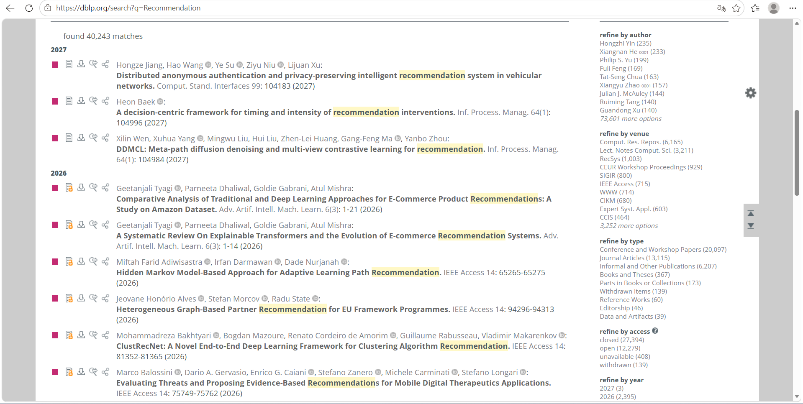

![[检索2.png|697]]

![[检索3.png]]
说明：该截图记录了在 DBLP 中以recommendation、Large Language Models recommendation、LLM recommendation等关键词进行检索的过程。该步骤用于从可信论文数据库中定位推荐系统方向的 CCF-A 会议论文。

### 3.2 论文 1：LLM2Rec 检索与核验

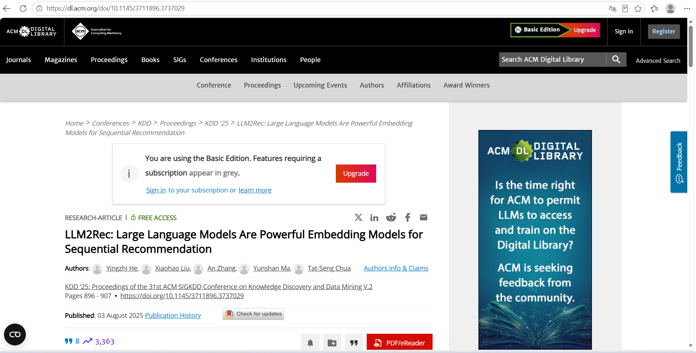

说明：该截图对应论文 `LLM2Rec: Large Language Models Are Powerful Embedding Models for Sequential Recommendation` 的 DBLP 条目，用于核验作者、KDD 2025、页码、DOI 与 BibTeX 信息。

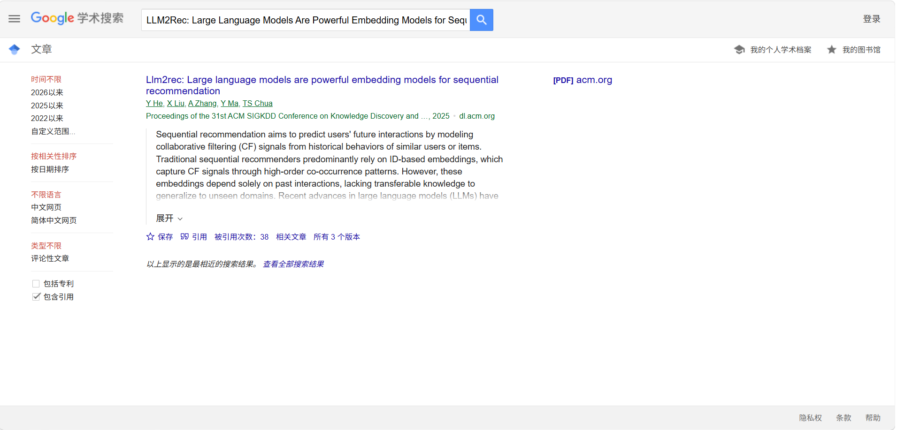

说明：该截图记录了在 Google Scholar 中检索论文 1 的结果，用于确认论文在学术搜索中可检索，并可进一步查看引用、相关文章和引用格式。

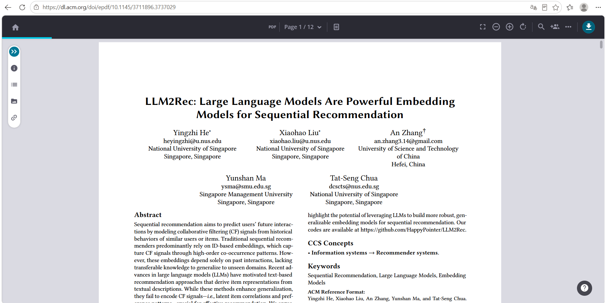

说明：该截图记录了论文 1 的 PDF 阅读页面，说明该论文已进入正文阅读阶段，可作为第六课精读对象。

### 3.3 论文 2：LLaRA 检索与核验

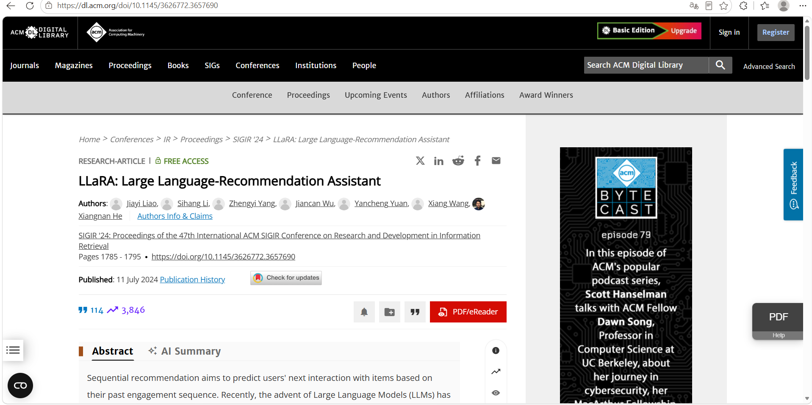

说明：该截图对应论文 `LLaRA: Large Language-Recommendation Assistant` 的 DBLP 条目，用于核验其发表在 SIGIR 2024，属于 CCF-A 会议论文。

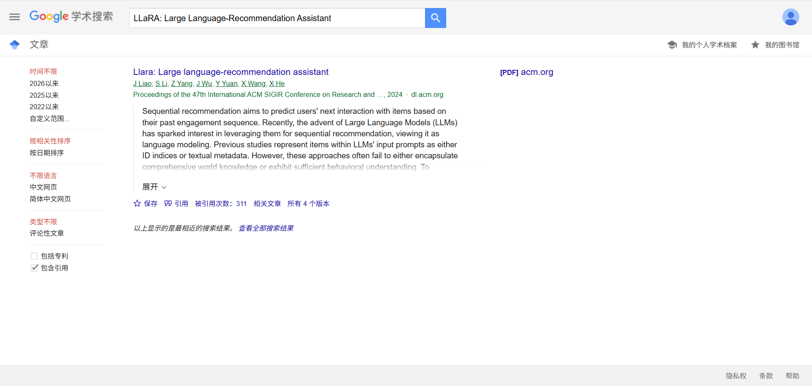

说明：该截图记录了在 Google Scholar 中对 LLaRA 的检索结果，用于确认论文可被学术搜索检索，并观察其引用和相关文献入口。

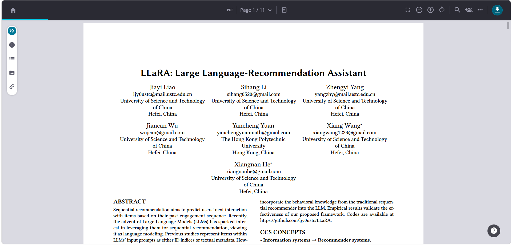

说明：该截图记录了 LLaRA 的 PDF 阅读页面，说明该论文已完成初步浏览，适合作为 LLM 推荐方向的候选论文。

### 3.4 论文 3：Data-efficient Fine-tuning 检索与核验

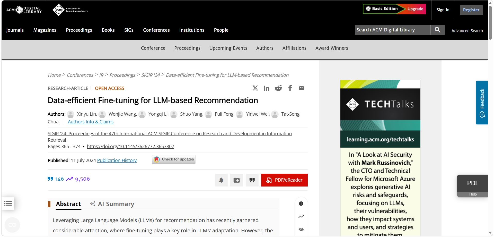

说明：该截图对应论文 `Data-efficient Fine-tuning for LLM-based Recommendation` 的 DBLP 条目，用于核验其发表在 SIGIR 2024，属于 CCF-A 会议论文。

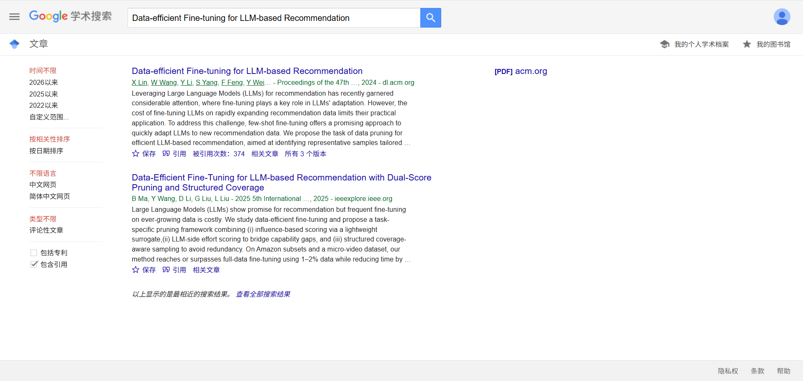

说明：该截图记录了在 Google Scholar 中对论文 3 的检索结果，用于确认其可检索性、引用入口和相关论文入口。

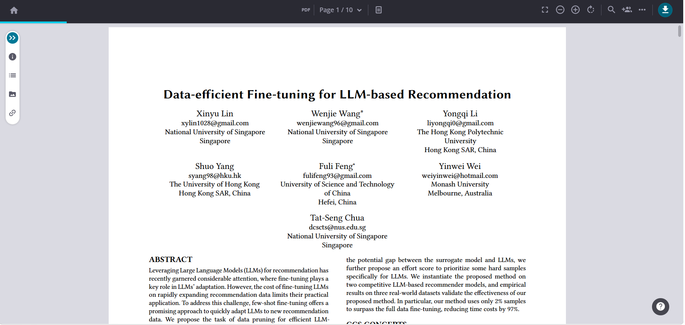

说明：该截图记录了论文 3 的 PDF 阅读页面，说明该论文已完成初步浏览，适合作为“高效微调与数据筛选”方向的候选论文。

### 3.5 Zotero 归档记录

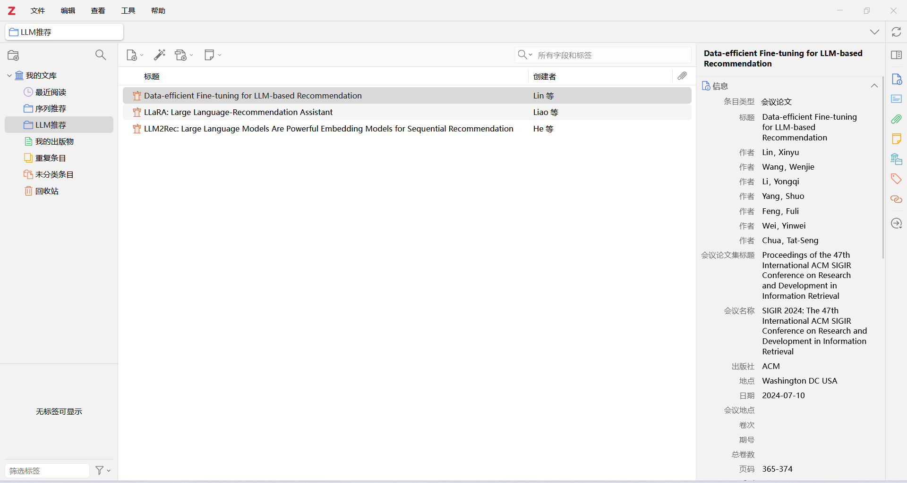

说明：该截图记录了 Zotero 中对候选论文的归档情况。通过 Zotero 可以对推荐系统方向论文进行分类、打标签、保存元数据，并为后续阅读和引用导出做准备。

## 4. 候选论文总表

| 优先级 | 论文 | CCF-A 会议 | 年份 | 方向 | 推荐理由 |
|---|---|---|---:|---|---|
| 1 | LLM2Rec: Large Language Models Are Powerful Embedding Models for Sequential Recommendation | KDD | 2025 | LLM + 序列推荐 | 最新的 CCF-A 推荐系统论文，题目清晰，适合作为精读对象 |
| 2 | LLaRA: Large Language-Recommendation Assistant | SIGIR | 2024 | LLM 推荐助手 | 将传统推荐模型与大语言模型结合，是 LLM4Rec 的代表性工作 |
| 3 | Data-efficient Fine-tuning for LLM-based Recommendation | SIGIR | 2024 | LLM 推荐微调 | 聚焦 LLM 推荐中的高成本微调问题，研究问题具体且有实践意义 |

## 5. 论文卡片

### 5.1 论文卡片 1：LLM2Rec

| 项目 | 内容 |
|---|---|
| 论文题目 | LLM2Rec: Large Language Models Are Powerful Embedding Models for Sequential Recommendation |
| 作者 | Yingzhi He, Xiaohao Liu, An Zhang, Yunshan Ma, Tat-Seng Chua |
| 发表会议 | KDD 2025 |
| CCF 分类 | CCF-A，SIGKDD 属于数据库/数据挖掘/内容检索方向 A 类会议 |
| 页码 | 896-907 |
| DOI | 10.1145/3711896.3737029 |
| DBLP Key | conf/kdd/HeL0MC25 |
| 检索来源 | DBLP 主检索，Google Scholar 核验 |
| 研究方向 | 大语言模型推荐、序列推荐、用户行为序列表征 |
| 候选理由 | 该论文将大语言模型作为强大的序列推荐嵌入模型，问题定义直观，和推荐系统中的用户行为序列建模紧密相关。论文发表于 KDD 2025，时间新、会议级别高，适合作为第六课精读对象。 |
| 初步理解 | 传统序列推荐模型通常学习用户历史交互序列中的行为模式，而该论文尝试利用大语言模型的语义理解能力和表示能力，为序列推荐提供更强的嵌入表达。 |
| 想读懂的问题 | 1. LLM 在该论文中具体如何转化为推荐中的 embedding model？<br>2. 它相比传统序列推荐模型的优势主要来自语义知识、参数规模还是训练方式？<br>3. 论文如何控制 LLM 引入推荐任务后的计算成本？ |
| 是否适合精读 | 非常适合。建议将其作为最终精读论文。 |

### 5.2 论文卡片 2：LLaRA

| 项目 | 内容 |
|---|---|
| 论文题目 | LLaRA: Large Language-Recommendation Assistant |
| 作者 | Jiayi Liao, Sihang Li, Zhengyi Yang, Jiancan Wu, Yancheng Yuan, Xiang Wang, Xiangnan He |
| 发表会议 | SIGIR 2024 |
| CCF 分类 | CCF-A，SIGIR 属于数据库/数据挖掘/内容检索方向 A 类会议 |
| 页码 | 1785-1795 |
| DOI | 10.1145/3626772.3657690 |
| DBLP Key | conf/sigir/LiaoL0WYW024 |
| 检索来源 | DBLP 主检索，Google Scholar 核验 |
| 研究方向 | LLM 推荐助手、序列推荐、混合提示、行为表示对齐 |
| 候选理由 | 该论文尝试把传统推荐模型的 ID-based 行为表示与 LLM 的文本理解能力结合起来，是 LLM 与推荐系统融合的典型工作。 |
| 初步理解 | LLaRA 的关键思路是让 LLM 不只依赖文本提示，也能接收传统推荐模型学习到的用户行为信息，从而在推荐任务中同时利用语义知识和行为模式。 |
| 想读懂的问题 | 1. LLaRA 如何把推荐模型中的 item ID embedding 对齐到 LLM 输入空间？<br>2. 混合提示相比纯文本提示具体提升在哪里？<br>3. 课程学习策略在训练过程中解决了什么问题？ |
| 是否适合精读 | 适合作为候选精读论文，尤其适合研究 LLM 与传统推荐模型如何融合。 |

### 5.3 论文卡片 3：Data-efficient Fine-tuning

| 项目 | 内容 |
|---|---|
| 论文题目 | Data-efficient Fine-tuning for LLM-based Recommendation |
| 作者 | Xinyu Lin, Wenjie Wang, Yongqi Li, Shuo Yang, Fuli Feng, Yinwei Wei, Tat-Seng Chua |
| 发表会议 | SIGIR 2024 |
| CCF 分类 | CCF-A，SIGIR 属于数据库/数据挖掘/内容检索方向 A 类会议 |
| 页码 | 365-374 |
| DOI | 10.1145/3626772.3657807 |
| DBLP Key | conf/sigir/LinWLYFWC24 |
| 检索来源 | DBLP 主检索，Google Scholar 核验 |
| 研究方向 | LLM 推荐、高效微调、数据剪枝、少样本学习 |
| 候选理由 | LLM-based recommendation 面临微调成本高的问题，该论文从数据效率角度切入，通过筛选更有代表性的训练样本降低微调成本，问题明确且有应用价值。 |
| 初步理解 | 该论文不是单纯改模型结构，而是关注“用哪些数据微调更有效”。它通过数据剪枝选择更有影响力的训练样本，从而减少训练时间和计算成本。 |
| 想读懂的问题 | 1. 论文如何定义推荐任务中的“有影响力样本”？<br>2. 数据剪枝方法和传统 coreset selection 有什么区别？<br>3. 只使用少量数据微调时，性能为什么还能保持甚至提升？ |
| 是否适合精读 | 适合作为候选精读论文，尤其适合关注效率、训练成本和实际部署问题。 |

## 6. 最终精读论文选择

我最终选择 `LLM2Rec: Large Language Models Are Powerful Embedding Models for Sequential Recommendation` 作为第六课精读对象。

选择理由如下：

1. 会议级别高：该论文发表于 KDD 2025，属于 CCF-A 会议论文。
2. 时间较新：2025 年论文，能够反映 LLM 与推荐系统结合的最新研究趋势。
3. 主题聚焦：论文围绕 LLM 如何作为序列推荐中的 embedding model 展开，问题明确，适合精读。
4. 与课程主题贴合：推荐系统课程中常见的序列推荐、用户行为建模、item representation 等概念都能在该论文中找到对应。
5. 便于延伸阅读：它可以和 LLaRA、Data-efficient Fine-tuning 等 LLM 推荐论文形成一组候选论文链条。

## 7. 双向引用与关系链初步整理

本次候选论文之间可以形成如下阅读路径：

```text
传统序列推荐 / ID-based 表示
        ↓
LLaRA: 将传统推荐模型的行为表示接入 LLM
        ↓
LLM2Rec: 将 LLM 作为序列推荐的强 embedding model
        ↓
Data-efficient Fine-tuning: 解决 LLM 推荐中的微调成本问题
```

这条路径体现了从“传统推荐模型”到“LLM 增强推荐”，再到“LLM 推荐训练效率优化”的研究演进关系。

## 8. Zotero 归档说明

Zotero 中将使用如下分类：

```text
推荐系统_CCFA论文
  01_LLM推荐
  02_序列推荐
  03_高效微调
  04_候选精读
```

建议标签：

```text
CCF-A
KDD
SIGIR
LLM4Rec
Sequential Recommendation
Fine-tuning
Candidate
Chosen
```

本次截图中的 Zotero 归档记录已经能够证明候选论文已被纳入文献管理工具，后续可以继续补充 PDF、笔记、BibTeX 和阅读标签。

## 9. 小结

本次检索以 DBLP 为主，以 Google Scholar 为辅助核验，最终选出 3 篇推荐系统方向的 CCF-A 会议论文。三篇论文均与 LLM-based recommendation 相关，但侧重点不同：LLM2Rec 关注 LLM 表征能力，LLaRA 关注 LLM 与传统推荐模型融合，Data-efficient Fine-tuning 关注 LLM 推荐的微调效率。综合会议级别、发表时间、主题清晰度和精读可行性，最终推荐将 LLM2Rec 作为第六课精读对象。
